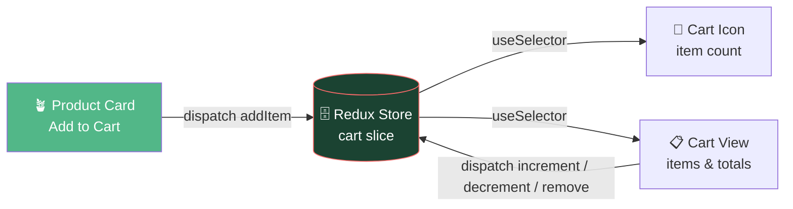
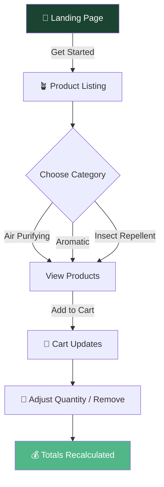

<a name="top"></a>
<div align="center">


<br/>


<br/><br/>


<br/><br/>


<br/><br/>

<a href="https://www.coursera.org/learn/developing-frontend-apps-with-react/home/welcome">

</a>

<br/><br/>


</div>

<br/><br/>

> A modern, functional shopping cart application for an online plant shop — browse categorized houseplants, add them to a live cart, and manage quantities with instantly recalculated totals. Built with **React** and **Redux Toolkit** for clean, predictable state management.
>
> This project is the **final capstone project** for IBM's [*Developing Front-End Apps with React*](https://www.coursera.org/learn/developing-frontend-apps-with-react/home/welcome) course on Coursera.

<br/>

## 📖 Table of Contents

<details open>
<summary><b>▼ Click to expand / collapse</b></summary>

<br/>

- [✨ Features](#features)
- [🪴 Product Categories](#product-categories)
- [🧠 Redux Data Flow](#redux-data-flow)
- [🛍️ User Flow](#user-flow)
- [🛠️ Tech Stack](#tech-stack)
- [🚀 Getting Started](#getting-started)
- [👤 Author](#author)

</details>

<br/>

---

<br/>

## ✨ Features

| | Feature | Description |
|:---:|---|---|
| 🌿 | **Landing Page** | Welcoming intro featuring the company name, a brief background, and a "Get Started" button |
| 🪴 | **Product Listing** | Browse houseplants organized by category, each with an image, name, description, and price |
| 🛒 | **Shopping Cart** | Add products to your cart — the cart icon updates live to reflect total item count |
| 🔧 | **Cart Management** | Increase/decrease quantities, remove items, and see totals recalculate automatically |

<br/>

---

<br/>

## 🪴 Product Categories

<div align="center">


</div>

<br/>

---

<br/>

## 🧠 Redux Data Flow

*How adding an item to the cart propagates through the app — a typical Redux Toolkit pattern:*



<br/>

---

<br/>

## 🛍️ User Flow



<br/>

---

<br/>

## 🛠️ Tech Stack

| Technology | Purpose |
|---|---|
| **React** | UI component library |
| **Redux Toolkit** | Predictable, centralized cart state management |
| **Vite** | Fast dev server and build tooling |
| **CSS3** | Styling |

<br/>

---

<br/>

## 🚀 Getting Started

<div align="center">


</div>

<br/>

```bash
# Install dependencies
npm install

# Start the development server
npm run dev
```

<br/>

---

<br/>

## 👤 Author

<div align="center">

### Talha Yaseen

<br/>

<a href="mailto:talhavectorarts@gmail.com">
  
</a>
<a href="https://www.linkedin.com/in/talha-yaseen-44a41a341">
  
</a>
<a href="https://github.com/Talha-Yaseen-Hub">
  
</a>

<br/><br/>

<sub>📌 Assumed this follows your established identity from your other repos — let me know if this project has different author details.</sub>

</div>

<br/><br/>

<div align="center">

[⬆ Back to Top](#top)

<br/><br/>


</div>
