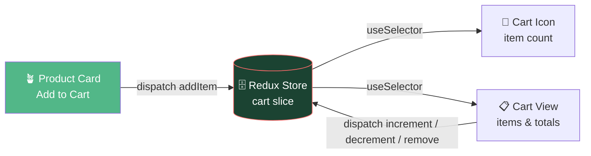
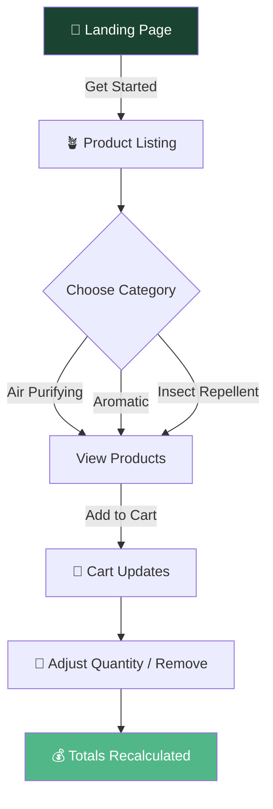
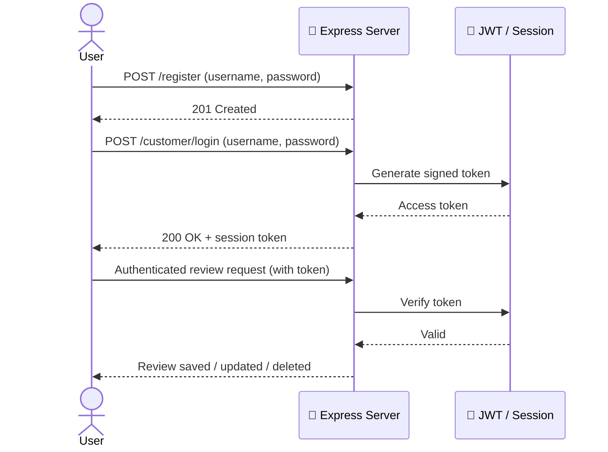
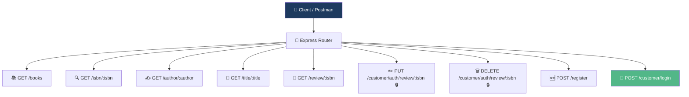

<a name="top"></a>
<div align="center">

<div align="center"> 

<br/>


<br/><br/>


<br/><br/>

<a href="https://www.coursera.org/learn/developing-frontend-apps-with-react/home/welcome">

</a>
<br/>
<a href="https://www.coursera.org/learn/developing-backend-apps-with-nodejs-and-express">

</a>

<br/><br/>


</div>

<br/><br/>

> This repository contains **two final capstone projects** completed for IBM Developer Skills Network certifications on Coursera — a front-end plant shop built with **React & Redux Toolkit**, and a back-end bookstore API built with **Node.js & Express**.

<br/>

## 📖 Table of Contents

<details open>
<summary><b>▼ Click to expand / collapse</b></summary>

<br/>

<table>
<tr>
<td valign="top">

**🪴 Project 1 — Paradise Nursery**
- [Features](#1-paradise-nursery-features)
- [Product Categories](#product-categories)
- [Redux Data Flow](#redux-data-flow)
- [User Flow](#user-flow)
- [Tech Stack](#paradise-nursery-tech-stack)
- [Getting Started](#paradise-nursery-getting-started)

</td>
<td valign="top">

**📚 Project 2 — Express Book Review**
- [Features](#2-express-book-review-features)
- [Auth Flow](#auth-flow)
- [API Route Map](#api-route-map)
- [Tech Stack](#express-book-review-tech-stack)
- [Getting Started](#express-book-review-getting-started)

</td>
</tr>
</table>

[👤 Author](#author)

</details>

<br/>

---

<br/>

# 🪴 1. Paradise Nursery
**React.js & Redux Toolkit**

A beautiful, functional shopping cart application for an online plant shop — browse categorized houseplants, add them to a live cart, and manage quantities with instantly recalculated totals.

<br/>

### Paradise Nursery — Features

| | Feature | Description |
|:---:|---|---|
| 🌿 | **Landing Page** | Welcoming intro featuring the company name, a brief background, and a "Get Started" button |
| 🪴 | **Product Listing** | Browse houseplants organized by category, each with an image, name, description, and price |
| 🛒 | **Shopping Cart** | Add products to your cart — the cart icon updates live to reflect total item count |
| 🔧 | **Cart Management** | Increase/decrease quantities, remove items, and see totals recalculate automatically |

<br/>

### Product Categories

<div align="center">


</div>

<br/>

### Redux Data Flow

*How adding an item to the cart propagates through the app:*



<br/>

### User Flow



<br/>

### Paradise Nursery — Tech Stack

| Technology | Purpose |
|---|---|
| **React.js** | UI component library |
| **Redux Toolkit** | Centralized cart state management |
| **Vite** | Fast dev server and build tooling |
| **CSS3** | Styling |

<br/>

### Paradise Nursery — Getting Started

```bash
# 1. Install dependencies (from the project root)
npm install

# 2. Start the development server
npm run dev

# 3. Open your browser to the localhost port shown in the terminal
```

<br/>

---

<br/>

# 📚 2. Express Book Review
**Node.js & Express.js**

A server-side application for an online bookstore — book search, review management, and secure user authentication, built with asynchronous operations via Promises and Async/Await.

<br/>

### Express Book Review — Features

| | Feature | Description |
|:---:|---|---|
| 📚 | **Book Retrieval** | List all available books, or search by ISBN, author name, or title |
| 💬 | **Review Management** | View reviews for a book; authenticated users can add, modify, or delete their own reviews |
| 🔐 | **User Authentication** | Register and log in securely using JSON Web Tokens (JWT) and session management |
| ⚡ | **Asynchronous Operations** | Uses Promises and Async/Await via Axios to interact with data efficiently |

<br/>

### Auth Flow



<br/>

### API Route Map

> ⚠️ *This reflects the standard route structure typical of this specific IBM capstone — verify it against your actual `router/` implementation before relying on exact paths.*



<br/>

### Express Book Review — Tech Stack

<div align="center">


</div>

<br/>

| Technology | Purpose |
|---|---|
| **Node.js** | JavaScript runtime |
| **Express.js** | Web application / routing framework |
| **JSON Web Tokens (JWT) & Express Session** | Authentication and session management |
| **Axios** | Async/Await-based HTTP interactions |

<br/>

### Express Book Review — Getting Started

```bash
# 1. Navigate to the backend directory
cd expressBookReview

# 2. Install dependencies
npm install

# 3. Start the server
npm start
```

Server runs on **port `5000`** — test endpoints via Postman or cURL.

<br/>

---

<br/>

## 👤 Author

<div align="center">

### Talha Yaseen

<br/>

<a href="mailto:talhavectorarts@gmail.com">
  
</a>
<a href="https://www.linkedin.com/in/talha-yaseen-44a41a341">
  
</a>
<a href="https://github.com/Talha-Yaseen-Hub">
  
</a>

</div>

<br/><br/>

<div align="center">

[⬆ Back to Top](#top)

<br/><br/>


</div>
